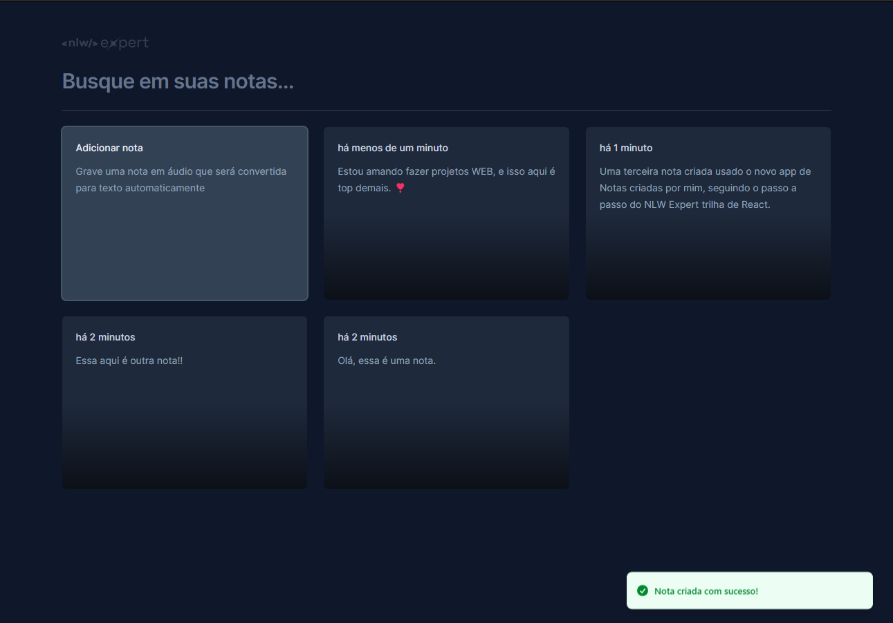

# Notes

Essa projeto foi criado segundo as aulas do __NLW Expert trilha de React__ realizado entre os dias __05/02/2024__ e __09/02/2024__, curso ministrado pelo Diego da RocketSeat.



## 🚀 Começando

Para ter uma copia deste projeto você pode baixar via ``git clone`` ou pelo aquivo zip diponibilizado no [link](https://github.com/MatheusWesley/notes) deste repositório.

### 📋 Pré-requisitos

Para usar você precisará ter um NodeJS ``v21.6.2`` e npm ``v10.2.4`` ou superior instalado em sua maquina. Caso ainda não tenha basta realizar o proceso de instalação segindo o passo a passo disponibilizado no proprio site da plataforma clicando [aqui](https://nodejs.org/).

### 🔧 Instalação

Após ter o node instalado em sua maquina basta realizar o processo de configuração do projato em sua maquina seguindo o passo a passo abaixo.

Primeiro, entre na pasta do projeto:
```console
cd notes
```
Segundo, apague pasta ``.git`` para evitar problemas na hora de subir o projeto para o seu github:
```console
rm -rf .git
```

Para finalizar realize a instalação das dependencias usanbdo o ``npm``:
```console
npm install
```

e inicie o projeto:
```console
npm run dev
```

## 🛠️ Construído com

Esse projeto foi criado com as seguintes tecnologias

* [NodeJS](https://nodejs.org/en)
* [ReactJS](https://react.dev/)
* [TailwindCSS](https://tailwindcss.com/)
* [ViteJS](https://vitejs.dev/)
* [TypeScript](https://www.typescriptlang.org/)

## ✒️ Autores

* **Matheus Wesley** - *Projeto completo* - [meu Githib](https://github.com/matheuswesley)